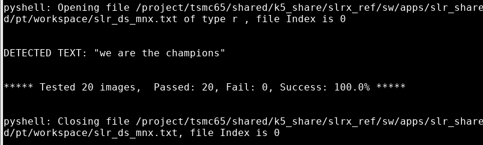

# FPGA_Excellarator: HW/SW Co-Design CNN Accelerator

This repository presents the design, implementation, and rigorous optimization of a hardware accelerator subsystem tailored for Convolutional Neural Networks (CNNs), synthesized on an Intel/Altera DE10-Lite FPGA and tightly coupled with a custom RISC-V (Kuntz5) CPU.

---

## 🎯 Project Objective & Performance Breakthrough

The core mission of this project was to lift the immense mathematical burden of deep learning workloads off the main processor and execute them on custom, high-throughput hardware pipelines.

* **The Baseline (Pure Software on RISC-V):** Initially, running the CNN inference completely in software on the RISC-V (Kuntz5) core was heavily constrained by sequential scalar ALU instructions. Executing a single full operational pass required **over 1,000,000 clock cycles**, rendering real-time inference impossible.
* **The Solution (Hardware Accelerated):** By shifting to a custom hardware accelerator module and performing iterative HW/SW protocol refactoring, we eliminated processing overhead. We achieved a staggering **>250x overall speedup**, compressing the end-to-end execution latency down to exactly **4,029 clock cycles** and successfully beating our benchmark target of 4,000 cycles.

---

## 🗺️ System Architecture & Inference Execution Flow

The accelerator subsystem (`slrx.sv`) interfaces directly with the CPU's memory bus through a custom high-performance arbiter multiplexer (`xmem_intrf_mux.sv`). 

---

## 🏎️ Hardware Acceleration Process

The execution flow within the system relies on a well-defined protocol that orchestrates data movement and parallel math calculations across the hardware modules. The following flow diagram illustrates the iterative acceleration pipeline designed to maximize data reuse and bus efficiency:

### Core Acceleration & Synchronization Protocol:
1. **Unified Register Configuration:** Instead of continuously writing metadata for small sub-tasks, the C HAL driver programs the system's control registers exactly once per layer. It locks in the source memory pointers for inputs, weights, and biases, as well as the exact tensor boundaries (`lin_arr_in_dim`, `lin_arr_out_dim`).
2. **Input Vector Register-Locking:** The input feature maps or vectors are streamed from the main XMEM into internal hardware registers during a single `SETUP` phase. This allows the sub-accelerators to broadcast the activation data locally across internal arithmetic units without re-fetching it from outer memory.
3. **Padded Burst Weight Streaming:** During execution (`CALC`), the FSM isolates memory indexing from dynamic array constraints. It continuously pulls strict 32-byte chunks on every single clock cycle, maintaining full saturation of the 256-bit memory bus.
4. **Hardware Masking & Safe Storage:** The internal execution units calculate results for a full block of 32 channels simultaneously. If a layer is non-power-of-two (e.g., 27 channels), the boundary registers act as a digital mask, discarding extra calculations during the descaling and ReLU saturation phase, before performing a single wide-write burst out to the storage memory space.

---

## 🛠️ Deep Dive: Architectural Design of the Sub-Modules

To process the network efficiently, each hardware module was engineered from scratch around a domain-specific computing paradigm, bridging the gap between flexible software control and high-speed hardware dataflows:

### 1. Convolutional Layer (CONV)
* **Architectural Challenge:** Convolutions are heavily compute-bound and memory-bound, requiring multiple shifting windows to sweep across input channels. A serial approach wastes clock cycles repeatedly fetching overlapping pixels.
* **Hardware Realization:** The CONV module is designed around a **Shift-Register Processing Element (PE) Array**. The hardware streams 32 input activations in parallel and shifts them across local registers that act as a sliding window filter. This layout ensures that an input byte is read once from memory but used multiple times across different filter kernels concurrently, maximizing MAC (Multiply-Accumulate) unit density.

### 2. Max Pooling Layer (POOL)
* **Architectural Challenge:** Pooling layers require selecting the maximum value across a localized neighborhood matrix (e.g., $2 \times 2$ downsampling). This involves conditional comparisons that cause severe branching penalties on standard CPUs.
* **Hardware Realization:** The POOL module implements **Parallel Comparator Trees** combined with sequential line buffers. As row pixels stream through the 32-byte memory bus, hardware-wired logic performs spatial sorting and comparisons within a single clock cycle, tracking window limits automatically. This completely eliminates branching and writes out the compressed downsampled map back to XMEM in real time.

### 3. Fully Connected Layer (LINEAR)
* **Architectural Challenge:** Fully connected layers feature an massive amount of distinct weight arrays, turning execution into a strict memory-bound problem where every single input must multiply against thousands of floating or fixed points.
* **Hardware Realization:** The LINEAR module utilizes a **Broadcast-MAC Array Architecture**. Instead of sweeping individual rows sequentially, the C driver transposes the weight matrix into an input-major layout in a static buffer. The hardware then loads an entire row of 32 activations into registers once, and broadcasts a single activation byte to all 32 accumulators simultaneously. Each accumulator multiplies that shared activation with its respective column weight, calculating the entire output vector in a single combined pass.

---

## 📊 Final Execution Performance

By removing intermediate register handshake overhead and unifying memory strides to rigid 32-byte blocks, we achieved a seamless software-hardware co-design that completely eliminates stall cycles during continuous inference loops. 

The successful completion of the test suite verifies that all calculated values match the golden reference model exactly, completing the entire workload in a highly optimized cycle count:

