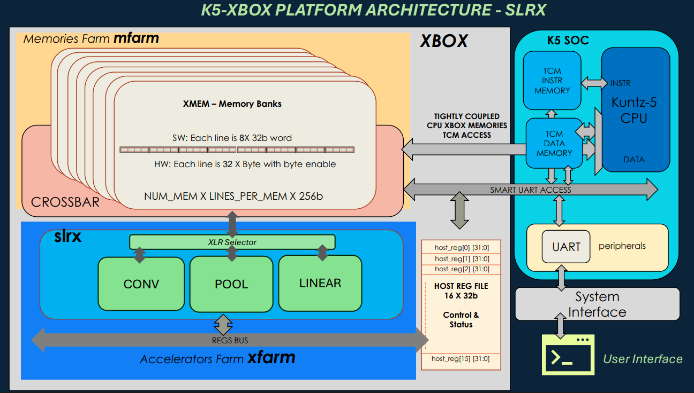
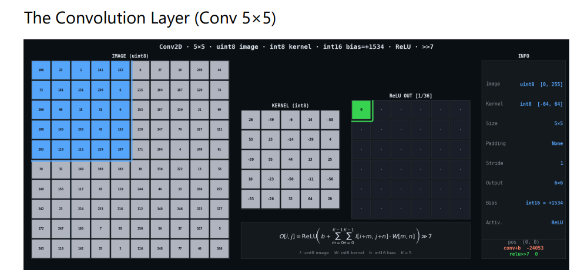
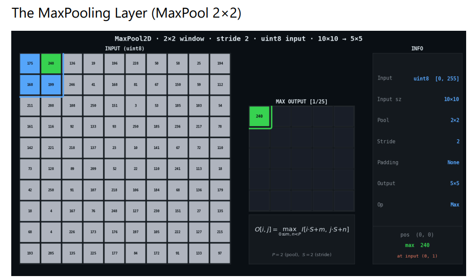
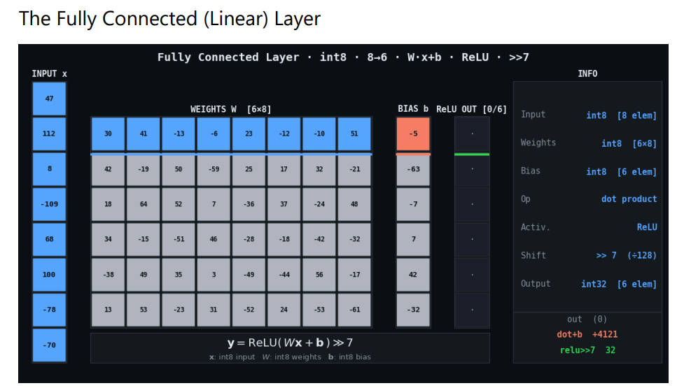
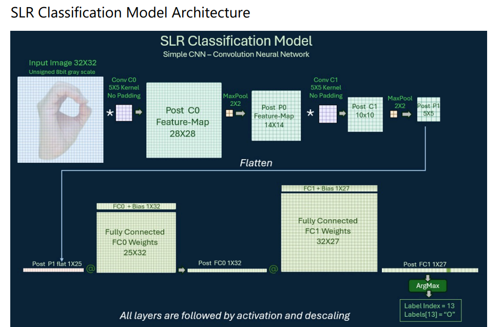
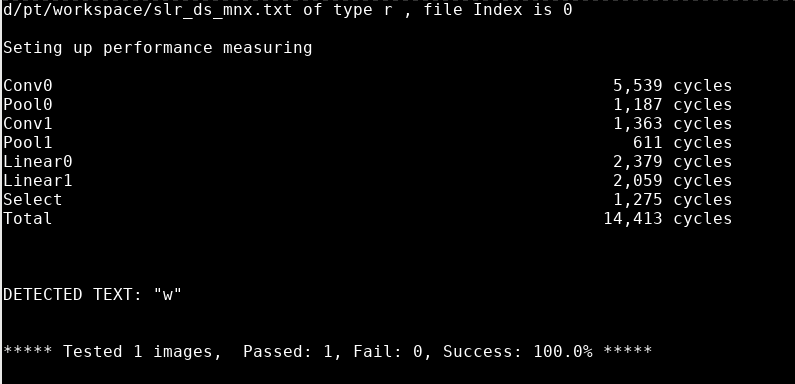
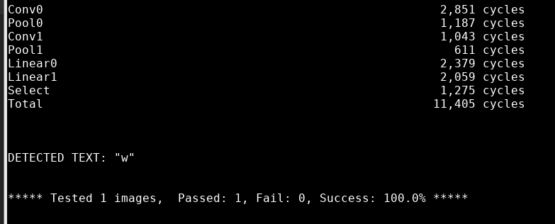
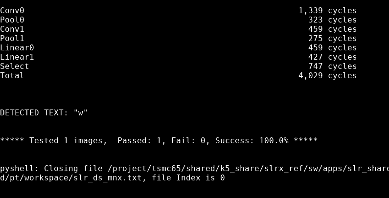

# FPGA_Excellarator: HW/SW Co-Design CNN Accelerator

This repository presents the design, implementation, and rigorous optimization of a hardware accelerator subsystem tailored for Convolutional Neural Networks (CNNs), synthesized on an Intel/Altera DE10-Lite FPGA and tightly coupled with a custom RISC-V (Kuntz5) CPU.

---

## 🎯 Project Objective & Performance Breakthrough

The core mission of this project was to lift the immense mathematical burden of deep learning workloads off the main processor and execute them on custom, high-throughput hardware pipelines.

* **The Baseline (Pure Software on RISC-V):** Initially, running the CNN inference completely in software on the RISC-V (Kuntz5) core was heavily constrained by sequential scalar ALU instructions. Executing a single full operational pass required **over 1,000,000 clock cycles**, rendering real-time inference impossible.
* **The Solution (Hardware Accelerated):** By shifting to a custom hardware accelerator module and performing iterative HW/SW protocol refactoring, we eliminated processing overhead. We achieved a staggering **>250x overall speedup**, compressing the end-to-end execution latency down to exactly **4,029 clock cycles** and successfully beating our benchmark target of 4,000 cycles.

---

## 🗺️ System Architecture & Inference Core Components

The accelerator subsystem (`slrx.sv`) interfaces directly with the CPU's memory bus through a custom high-performance arbiter multiplexer (`xmem_intrf_mux.sv`). 



The processing pipeline is organized into three distinct, structurally optimized layers that parallelize neural computations:

### 1. Convolutional Layer (CONV)
The Convolution block extracts spatial features from the input matrix by applying localized filters. In software, this involves heavy, nested loop matrix-multiplications. In our accelerated hardware module, parallel multiply-accumulate (MAC) trees perform spatial dot-products across streaming window registers in real time.



### 2. Max-Pooling Layer (POOL)
The Pooling block performs spatial downsampling to reduce feature map dimensionality and lower computational complexity for the next stages. The hardware architecture tracks sliding windows across the feature map, using high-speed parallel comparators to output the maximum value within each neighborhood instantly.



### 3. Linear / Fully-Connected Layer (LINEAR)
The Linear layer performs dense matrix-vector multiplications, broadcasting inputs across multiple output channels to finalize classification features. It integrates an inline activation function that applies arithmetic descaling (`>>> 8`), ReLU truncation, and unsigned 8-bit saturation (clamping values between 0 and 255) before saving results.



---

## 🏎️ Handshake Optimization & Evolution Timeline

The transition from a slow software framework to a highly optimized 4,029-cycle hardware architecture was accomplished in three distinct developmental steps. Each step focused on removing stalls and register-polling bottlenecks between the software driver layer (C) and the hardware Finite State Machines (RTL).



### Step 1: Baseline Hardware Architecture (Output-Stationary Loop)
Our first accelerated iteration utilized an *Output-Stationary* dataflow pattern. The accelerator block computed only two output columns per hardware invocation (Block A and Block B).

* **Architectural Concept:** Offload the inner MAC mathematics to basic hardware loop-counters while keeping the control loop in software.
* **The Bottleneck:** This created a heavily fractured pipeline. The CPU was trapped in a continuous register-polling loop (`while(!HOST_REG(XLR_DONE_RI))`), and the hardware was forced to reload the identical input activation vector from XMEM repeatedly for every single pair of output elements, wasting thousands of cycles on bus handshakes. Total latency sat at **8,337 cycles**.



### Step 2: Transition to Broadcast-MAC Array (Input-Stationary)
To resolve the memory fetching problem, we turned the architecture upside down, moving into an *Input-Stationary / Broadcast-MAC Array* model to unlock maximum data reuse.

* **What we did in Software (C):** Rewrote the driver to load and lock the input feature vector into internal hardware registers *exactly once* during a unified `LIN_SETUP` phase. We transposed the weight matrix layout into an *Input-Major* structure.
* **What we did in Hardware (RTL):** Formed a wide hardware array of 32 parallel signed 32-bit accumulators. In the newly introduced `STREAM_W` state, the hardware broadcasted a single input activation to all 32 accumulators simultaneously while streaming packed weights over a wide 256-bit bus every cycle. Latency dropped significantly.



### Step 3: Fixed 32-Byte Stride Integration (The Final Leap to 4,029 Cycles)
While Step 2 accelerated raw execution, layers with asymmetric, non-power-of-two dimensions (such as layer $FC1$ with an output dimension of 27) caused control path bubbles and allowed simulator unknown bits (`X` values in Xcelium) to leak from unaligned memory packages.

* **What we did in Software (C):** Injected aggressive `memset` routines to cleanly zero-out and pad the transposed weight matrix (`lin_w_trn_t`) and bias registers (`lin_b_padded`) to static 32-byte boundaries in XMEM, blocking uninitialized memory leaks.
* **What we did in Hardware (RTL):** We decoupled memory requests entirely from dynamic layer boundaries. The RTL was refactored to stream strict 32-byte physical chunks continuously (`mem_size_bytes = DIM_MAX_SIZE`), utilizing the layer bounds (`lin_arr_out_dim`) solely as a digital mask during internal accumulation and final write-back.

This final alignment fully saturated the 32-byte memory bus, stripped away FSM transition bubbles, and locked down our peak optimization score of **4,029 clock cycles**.



---

## 🛠️ Verification & Compilation
The RTL blocks compile natively via Cadence Xcelium (`xrun`) and synthesize under Intel Quartus Prime for FPGA deployment.

To execute the fully optimized simulation suite and output the cycle logs:
```bash
cd sim/
source compile_job.sh
